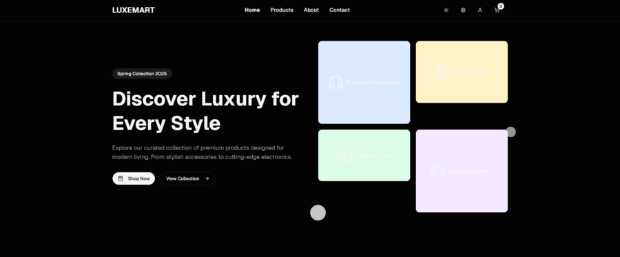
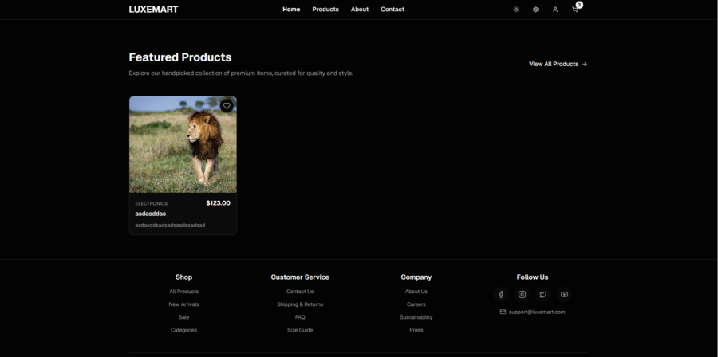
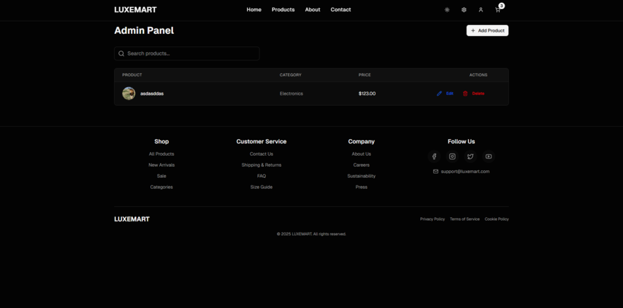

# eShop - Modular E-commerce System

eShop is an advanced, modular e-commerce system developed as a showcase of modern software architecture and full-stack development skills. The project leverages a variety of cutting-edge technologies to provide a scalable, maintainable, and feature-rich online shopping platform.

## Overview
- **Backend**: Built with .NET 9 using Clean Architecture, Domain-Driven Design (DDD), and CQRS patterns.
- **Frontend**: Developed with React and Next.js, offering a responsive and SEO-optimized user interface.
- **Deployment**: Containerized with Docker, using Caddy as a reverse proxy for HTTPS, and Azurite for local Azure Blob Storage emulation.
- **Repository**: [github.com/kacpersmaga/eShop](https://github.com/kacpersmaga/eShop)
- **Live Demo**: [kacpersmaga.pl](https://kacpersmaga.pl)

## Features
- Product management (CRUD operations: add, edit, delete, filter, sort, search by term or price range).
- Responsive frontend with dark/light mode and animations.
- Caching with Redis for improved performance.
- Photo storage using Azure Blob Storage (or Azurite locally).
- Automatic database migrations with MSSQL.
- API documentation via Swagger.
- CI/CD pipelines with GitHub Actions.

## Technologies
- **Backend**: C#, .NET 9, MSSQL, Redis, Azure Blob Storage, Docker, MediaTR, AutoMapper, FluentValidation, Serilog, Swagger
- **Frontend**: JavaScript, TypeScript, React, Next.js, Axios, Framer Motion, Tailwind CSS
- **DevOps**: Docker, Docker Compose, Git, GitHub Actions, Caddy, Azurite

## Project Structure
```
eShop/
├── backend/           # Backend source code (.NET 9)
├── frontend/          # Frontend source code (React/Next.js)
├── .github/           # GitHub workflows for CI/CD
├── docker-compose.yml # Docker Compose configuration for production
├── docker-compose.override.yml # Docker Compose overrides for development
├── Caddyfile          # Caddy reverse proxy configuration
└── README.md          # This file
```

## Prerequisites
- Docker and Docker Compose
- .NET 9 SDK
- Node.js (v18 or higher)
- Git

## Setup and Installation
1. **Clone the repository**:
   ```bash
   git clone https://github.com/kacpersmaga/eShop.git
   cd eShop
   ```
2. **Run in Development Mode**:
   ```bash
   docker-compose up --build
   ```
   - Backend API: `http://localhost:8080`
   - Frontend: `http://localhost:3000`
   - Swagger UI: `http://localhost:8080/swagger`
   - Azurite Blob Storage: `http://localhost:10000`
3. **Run in Production Mode**:
   ```bash
   docker-compose -f docker-compose.yml up --build
   ```
   - Access via `https://kacpersmaga.pl` (or configure your domain in `Caddyfile`).
   - Backend API proxied at `/api/*`.
   - Blob storage proxied at `/storage/*`.

## Configuration
- **Development**:
  - Backend exposes port `8080`.
  - Frontend exposes port `3000`.
  - Caddy is disabled by default (`replicas: 0`).
- **Production**:
  - Caddy handles HTTPS on ports `80` and `443`.
  - Environment variables are set in `docker-compose.yml` (e.g., `PUBLIC_BLOB_HOST`, `FrontendOrigin`, `CADDY_PROXY_IP`).
- Key environment variables:
  - `PUBLIC_BLOB_HOST`: Public URL for Azure Blob Storage (e.g., `https://kacpersmaga.pl/storage`).
  - `FrontendOrigin`: CORS-allowed frontend origin (e.g., `https://kacpersmaga.pl`).
  - `CADDY_PROXY_IP`: IP for forwarded headers configuration.
  - `NEXT_PUBLIC_API_URL`: Frontend API base URL (e.g., `https://kacpersmaga.pl/api`).
  - `NEXT_PUBLIC_IMAGE_DOMAIN`: Domain for Next.js image optimization (e.g., `kacpersmaga.pl` or your custom domain).

## Services
- **db**: MSSQL Server (port `1433`).
- **redis**: Redis with password protection.
- **azurite**: Local Azure Blob Storage emulator (ports `10000-10002`).
- **eshop**: Backend API service.
- **frontend**: Next.js frontend service.
- **caddy**: Reverse proxy for HTTPS and routing.

## Screenshots
Below are previews of the eShop application, showcasing key pages and their respective routes. Click each preview to view the full-size image.

| Homepage (`/`) | Homepage (Scrolled) (`/`) | Products (`/products`) | Admin Panel (`/admin`) |
|----------------|---------------------------|------------------------|-----------------------|
| [](screenshots/homepage1.PNG) | [](screenshots/homepage2.PNG) | [](screenshots/products.PNG) | [](screenshots/admin.PNG) |
| The main landing page of the eShop, accessible when you visit the site. | The homepage view after scrolling down, showing more content. | The products page, where users can browse, filter, and search for items. | The admin panel for managing products.

## Contributing
Feel free to fork the repository, create a feature branch, and submit a pull request. All contributions are welcome!

## Author
Kacper Smaga  
- Email: kacper.smaga@onet.pl  
- GitHub: [kacpersmaga](https://github.com/kacpersmaga)